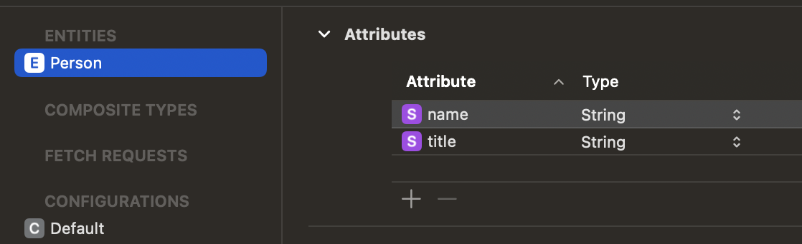

# Basic Usage

1) Create a DataModel
2) Create an Entity at your .xcdatamodel or Create NSManagedObject Subclass
### If you are not creating NSManagedObject leave the codegen as Class Definition



## Setup 
1) Import CTCoreData module:
``` swift
import CTCoreData
```
2) Create your Custom CoreDataManager by inheriting CTCoreDataManager:
``` swift
final class CoreDataManager: CTCoreData {}
```
3) Initialize the super class with the name of your .xcdatamodel at the init of your Manager:
``` swift
override private init() {
    super.init(storageName: "YOUR_DATA_MODEL")
} 
```

## Basic Operations

### Create
You may create an object simply by create method, however you need to save the context by calling update method after you've made your changes:
``` swift
coreDataManager.create(type: Person.self) { [weak self] result in
    guard let self else { return }
    switch result {
        case let .success(person):
        person.name = name
        self.coreDataManager.update { updateResult in
            switch updateResult {
                case .success:
                    self.titleLabel.text = name
                case let .failure(error):
                    print(error.customMessage)
                }
            }
        case let.failure(error):
          print(error.customMessage)
    }
}
```

### Read
- You may simply read the objects just calling the read method:
``` swift
coreDataManager.read(type: Person.self)
```
- Also you may read the objects by filtering with NSPredicate:
``` swift
let predicate = NSPredicate(format: "name CONTAINS[cd] %@", "a")
coreDataManager.read(type: Person.self, predicate: predicate)
// success of result will have person array which has name containing a
```
- You may also sort the result by NSDescriptor:
``` swift
let sortDescriptor = NSSortDescriptor(key: "name", ascending: true)
coreDataManager.read(type: Person.self, sorDescriptors: [sortDescriptor])
// success of result will have person array which are sorted ascending by name
```

### Delete
You may delete objects as array simply by calling delete method:

``` swift
coreDataManager.delete(objects: [person])
```
